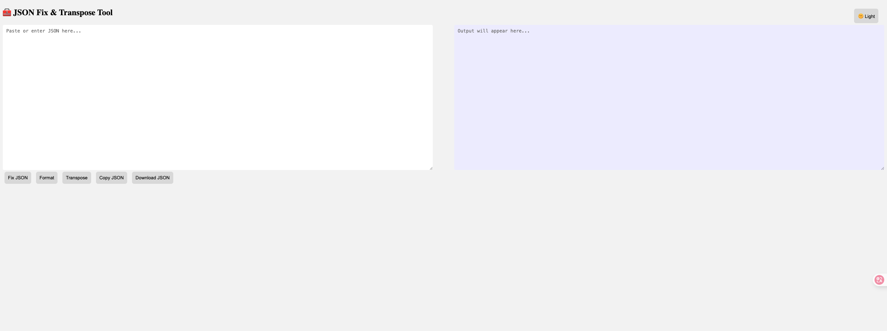
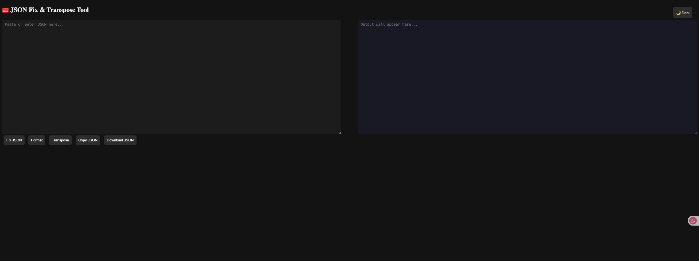

# 🧰 JSON Fix & Transpose Tool

A lightweight, single-file HTML tool for working with JSON offline. Features:

- ✅ Fix malformed JSON (e.g., single quotes, Python-style `None`, `True`, `False`)
- ✅ Format JSON (indent with 4 spaces)
- ✅ Transpose JSON (convert between `list[dict]` and `dict[list]`)
- ✅ Copy to clipboard (with top-center animation)
- ✅ Download as `.json` file
- ✅ Toggle between Light / Dark theme (remembers last selection)

📁 Simply open `src/index.html` in your browser — no installation or internet required.

---

## 🚀 How to Use

### Option 1: Open Directly (Recommended)

1. Download `src/index.html`
2. Double-click to open in Chrome, Edge, or any modern browser

### Option 2: Run Locally with Python

```bash
cd path/to/your/file
cd src
python -m http.server 8080
```

Visit: `http://localhost:8080/index.html`

---

## 📸 Screenshot

- Light Theme



- Dark Theme



---

## 📁 Project Structure

```
local-json-tool/
├── src/                     # Source files
│   ├── index.html           # Main HTML file
├── img/                     # Images for documentation
│   ├── light_mode.png       # Light theme screenshot
│   ├── dark_mode.png        # Dark theme screenshot
├── README.md                # English documentation
```

---

## 🪪 License

MIT
